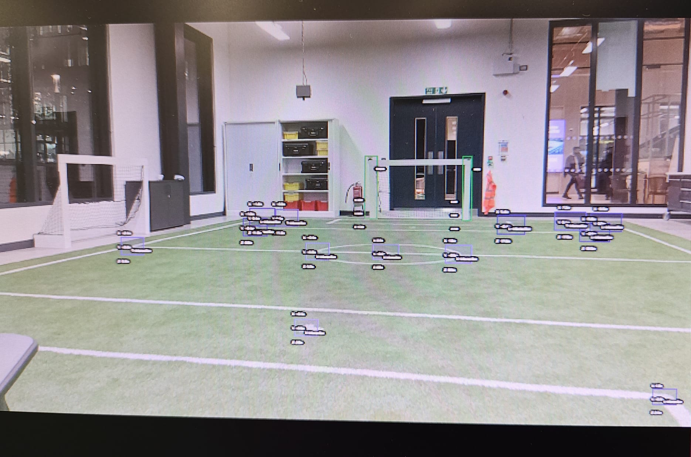

# Perception for KidSize Soccer Robots

This directory contains the ROS package dedicated to integrating and utilizing the **Luxonis OAK-D Lite camera** as the primary perception sensor for the Robotis-OP3 platform.

It is a high-performance, low-latency perception system developed for the ROBOTIS OP3 humanoid platform, specifically optimized for the STRIDE team in RoboCup KidSize football. 

This project replaces the stock OP3 camera and CPU-bound Darknet pipeline with a custom OAK-D Lite setup, leveraging the onboard Intel Movidius Myriad X VPU for real-time spatial AI.

## 1. Perception Model Training Details

The object detection model is based on YOLOv5 and was fine-tuned on a custom dataset.

* Model: YOLOv5  
* Dataset Source: [Roboflow Dataset Link](https://app.roboflow.com/ds/D37AFkS0Yv?key=2j4PngbPxy)  
* Training Environment: University HPC (High-Performance Computing)  
* Custom Training Guide: The training process followed the guidelines for custom YOLOv5 training as detailed by Roboflow: [How to Train YOLOv5 on a Custom Dataset](https://blog.roboflow.com/how-to-train-yolov5-on-a-custom-dataset/)

## 2. Initial Model Conversion and Deployment (Pruned FP32)

To deploy the fine-tuned PyTorch model (.pt) onto the OAK-D Lite's VPU, it must be converted into the OpenVINO .blob format. The initial conversion relied on the Luxonis online tools, which perform basic pruning but not full quantization (FP32 precision).

### Conversion Steps (using Luxonis Online Tools)

1. Download Weights: Retrieve the best fine-tuned weights file from the training output:  
   ./yolov5/runs/train/exp/weights/best.pt  
2. Access Conversion Tool: Navigate to the online Luxonis conversion platform:  
   tools.luxonis.com  
3. Configure Settings:  
   * Yolo Version: Set to YoloV5  
   * File: Upload the downloaded best.pt weights file.  
   * Input Shape: Set to 640 (Note: The training input shape was 640)  
4. Download output: Download the converted .blob file (e.g., best_openvino_2021.4_6shave.blob) and the corresponding config JSON file. Current model can be found in camera_model.

## 3. Running the Model on the OAK-D Lite (Device Decoding)

The converted .blob model is executed on the OAK device using the Luxonis example scripts.

### Setup and Execution

1. Clone Example Repository:  
   ```
   git clone \[https://github.com/luxonis/oak-examples.git\](https://github.com/luxonis/oak-examples.git)
   ```
2. Navigate to Target Branch/Directory:
   ```
   cd oak-examples  
   git checkout master  
   cd gen2-yolo/device-decoding/

3. Create Virtual Environment (Recommended):
   ```  
   python3 \-m venv venv  
   source venv/bin/activate

4. Install Dependencies:
   ```
   python3 \-m pip install \-r requirements.txt

5. Place converted files: Move the downloaded .blob and config .json files into the gen2-yolo/device-decoding/ folder.  
6. Run the Application:
   ```
   python3 main.py -m best_openvino_2021.4_6shave.blob -c best.json

## 4. Performance Benchmarks

The system was migrated from an onboard Intel NUC (CPU) to an optimized INT8 VPU pipeline to meet the strict latency requirements for closed-loop humanoid control.

| Platform       | Precision     | Latency | FPS  | Status     |
| -------------- | ------------- | ------- | ---- | ---------- |
| Intel NUC CPU  | ONNX FP32     | ~70 ms  | ~14  | Baseline   |
| OAK-D Lite VPU | OpenVINO FP32 | >500 ms | 1-2  | Unusable   |
| OAK-D Lite VPU | OpenVINO INT8 | ~10 ms  | ~100 | Production |

Note: Moving to INT8 achieved ultra-low latency with only a 1% drop in precision compared to the FP32 baseline.

### Model Performance & Benchmarks
The system runs a custom YOLOv5 model trained on 6 football-specific classes.

Training Metrics

* Precision: 95%
* mAP@0.5: 96%
* mAP@0.5:0.95: 69%

Augmentations: Applied Mosaic augmentation and custom Motion Blur/Shake filters to handle the jitter inherent in humanoid locomotion.

## 5. Video Demo

The following video demonstrates the robot's perspective during active movement, highlighting the robustness of the detection against camera shake and motion blur.


Below is an image of model performance on the OAK-D Lite



## 6. ROS 2 Package Setup (Jazzy Distribution)

The depthai-ros package provides the necessary bridge to integrate OAK-D data streams (RGB, Depth, NN detections) into the ROS 2 ecosystem.

### Installation

The depthai-ros package is available as a binary for several ROS distributions, including Jazzy.

Install the depthai-ros package for ROS 2 Jazzy  
```
sudo apt install ros-jazzy-depthai-ros
```
### Launching the Camera Driver with Custom NN

To deploy the custom model, launch the primary camera driver (depthai_ros_driver) and pass the configuration for your compiled model (.blob) and its JSON configuration file.

Replace the path placeholders with the full paths to your custom files.

Launch the camera driver, overriding the NN parameters  
```
ros2 launch depthai_ros_driver camera.launch.py \\  
    nn.i_nn_config_path:=/full/path/to/custom\_yolov5\_config.json \\  
    nn.i_blob_path:=/full/path/to/custom\_yolov5.blob \\  
    camera.i_nn_type:=spatial
```

| Parameter | Type | Value | Description |
| :---- | :---- | :---- | :---- |
| nn.i\_nn\_config\_path | string | Full path | Full path to JSON config file (defines labels, input size, etc.). |
| nn.i\_blob\_path | string | Full path | Full path to compiled MyriadX BLOB model file. |
| camera.i\_nn\_type | string | spatial or rgb | Set to spatial for 3D coordinates (Spatial YOLO) or rgb for only 2D bounding boxes. |

## 7. Visualization using depthai_filters

The depthai_filters package contains small composable nodes for working with data from multiple topics. The Detection2DOverlay node is particularly useful as it replicates the built-in oak.visualize() functionality by drawing bounding boxes on the camera feed.

### Node Description

The Detection2DOverlay node subscribes to two key topics published by the camera driver:

1. /oak/rgb/preview/image_raw (The raw camera feed)  
2. /oak/nn/detections (YOLO bounding box data and spatial coordinates)

It performs the overlay and publishes the final visualized image on a new topic.

### Running the Visualization Pipeline

Launch the Camera Driver (as shown in Section 2, ensuring your custom NN is running).  

Launch the Filter Node The depthai_filters package provides an example launch file to start the overlay node:  

```
   ros2 launch depthai\_filters example\_det2d\_overlay.launch.py
```
Note: If detections appear misaligned, you may need to adjust the rgb.i_preview_size parameter in your camera driver launch to match the expected resolution of your NN.

View the Overlayed Topic 

The filter node publishes the final image, typically to /oak/nn/overlay_image. Use rqt_image_view to visualize this topic in real-time:
```  
   ros2 run rqt\_image\_view rqt\_image\_view /oak/nn/overlay\_image
```

This view provides the bounding boxes drawn directly onto the image, confirming that both your custom NN and the ROS pipeline are functioning correctly.

## 8. Future Work
* Locomotion: Integrating vision with MuJoCo for RL-based planning.
* Control: Moving beyond perception into fast closed-loop locomotion control.